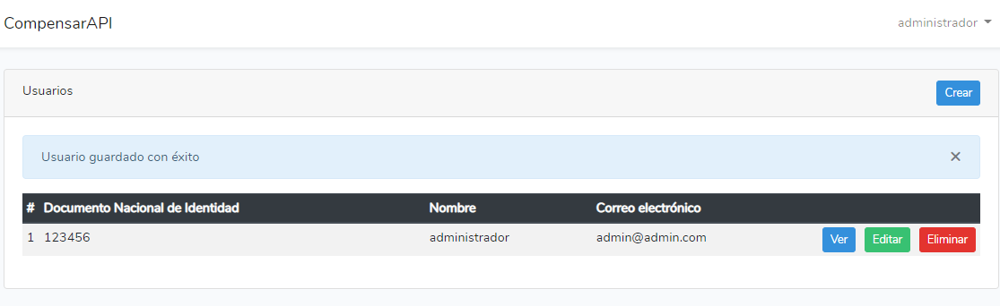
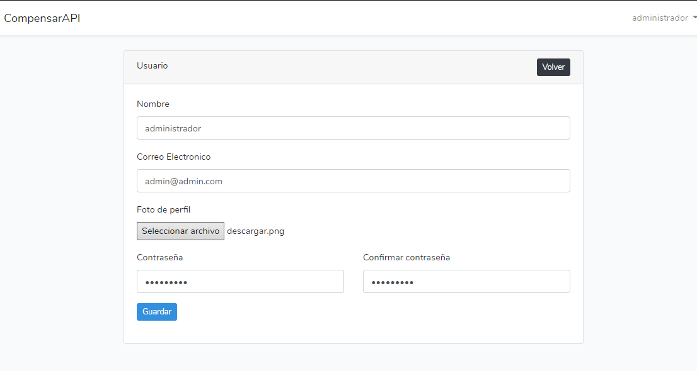
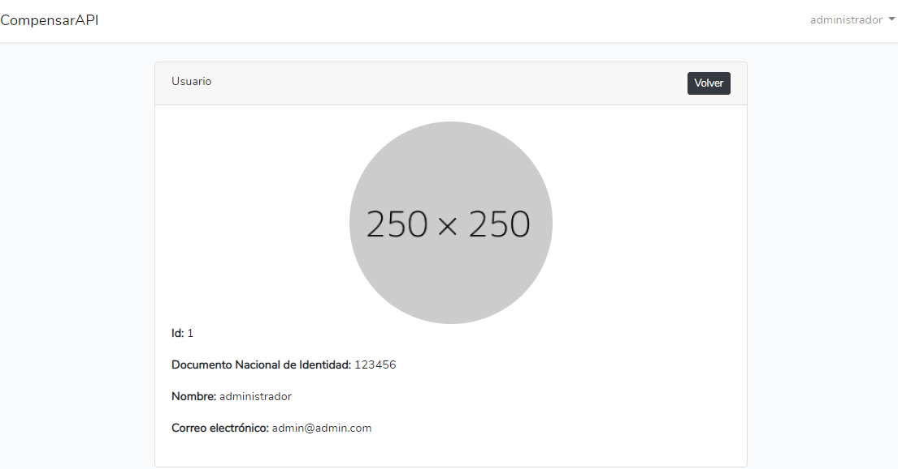

# CompensarAPI

Este projecto ha sido generado con [Laravel](https://laravel.com) version 8+.

## Como funcion la API

Es una API que permite el registro, inicio de sesión mediante documento y contraseña, recuperacion de contraseña mediante correo electronico, tambien permite la generacion de formularios de preguntas con diferentes tipos de respuesta (Si/No, Texto, Fecha, Numerico, Multiple respuesta opcion unica) y el respectivo registro de respuestas.

La documentacion de la API se encuentra en la carpeta Postman archivo: compesarAPI.postman_collection.json

## Como funciona la interfaz WEB 

Es un Monolito realizado el Lavel-Blade con algunas librerias adicionales, el cual permite a los usuarios de la anterior API el inicio de sesión mediante documento y clave y una matriz CRUD para el listado de usuario y la posibilidad de adjuntar foto de perfil.

## Nota: Envio de correo de recuperacion
Para la recuperacion de contraseñas mediante correo electronico se debe de realizar la respectiva configuracion del archivo .env, ya que este pierde la configuracion al subirse al github
